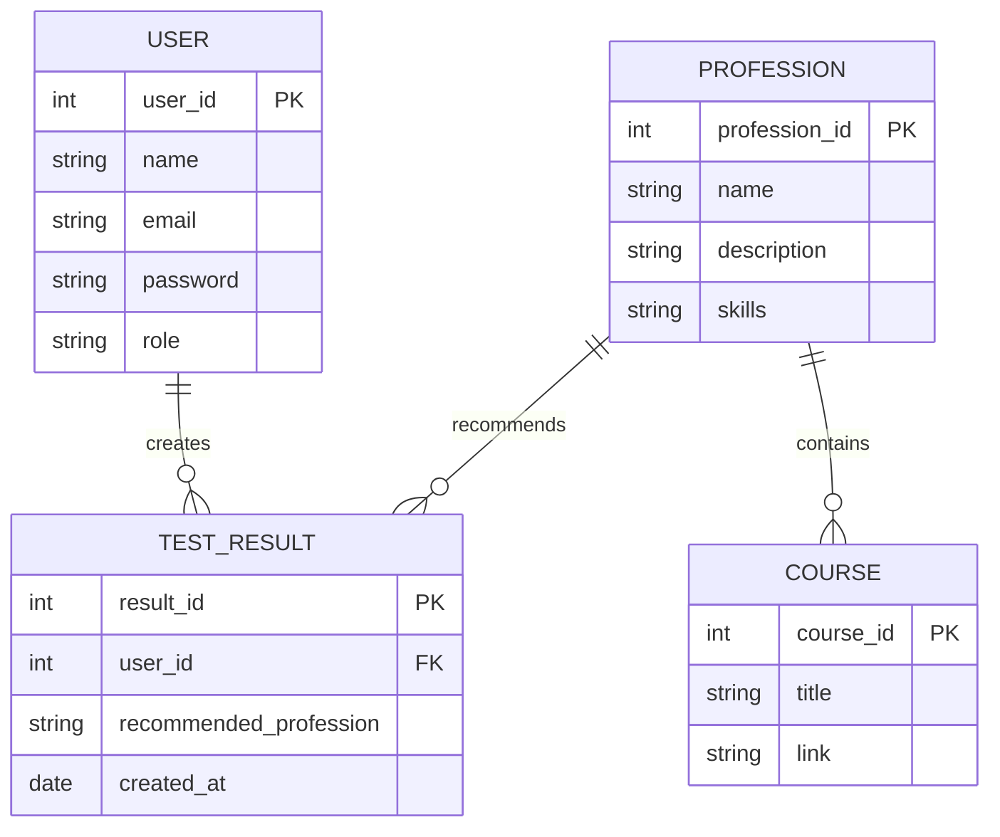
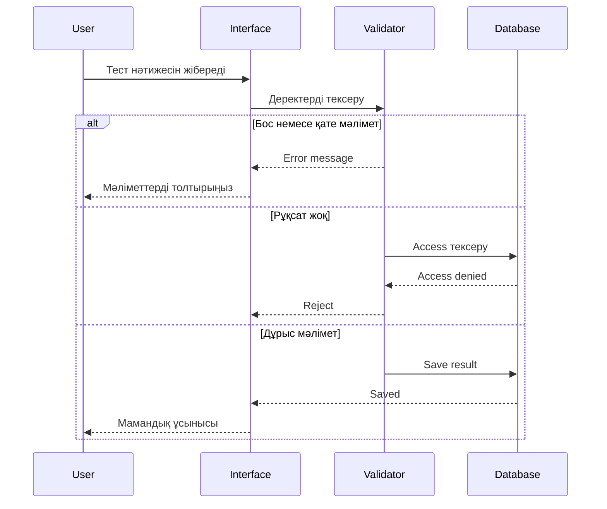

# Архитектуралық аудит және техқарыз

## Деректер қорының архитектурасы (ER-диаграмма)

---

## Қателерді өңдеу сценарийі (Sequence диаграмма)

---

# Архитектуралық аудит

## Масштабталғыштық

Егер қолданушылар саны 100 есе өссе, негізгі қиындық деректер қорындағы тест нәтижелерін іздеу жылдамдығы болады.

Шешімі:
- деректер базасын индекстеу;
- сұраныстарды оңтайландыру;
- кэш қолдану.

## Қауіпсіздік (OWASP)

1. Парольдерді ашық сақтау қаупі.

Шешімі:
- парольдерді hash арқылы сақтау.

2. API рұқсаттарының қорғалмауы.

Шешімі:
- Role Based Access Control (RBAC);
- JWT авторизация.

## Рефакторинг

Келесі Sprint:

- код құрылымын модульдерге бөлу;
- API жақсарту;
- автоматты тест жазу;
- қауіпсіздік тексерулерін қосу.

  ## User Flow (Stitch)
